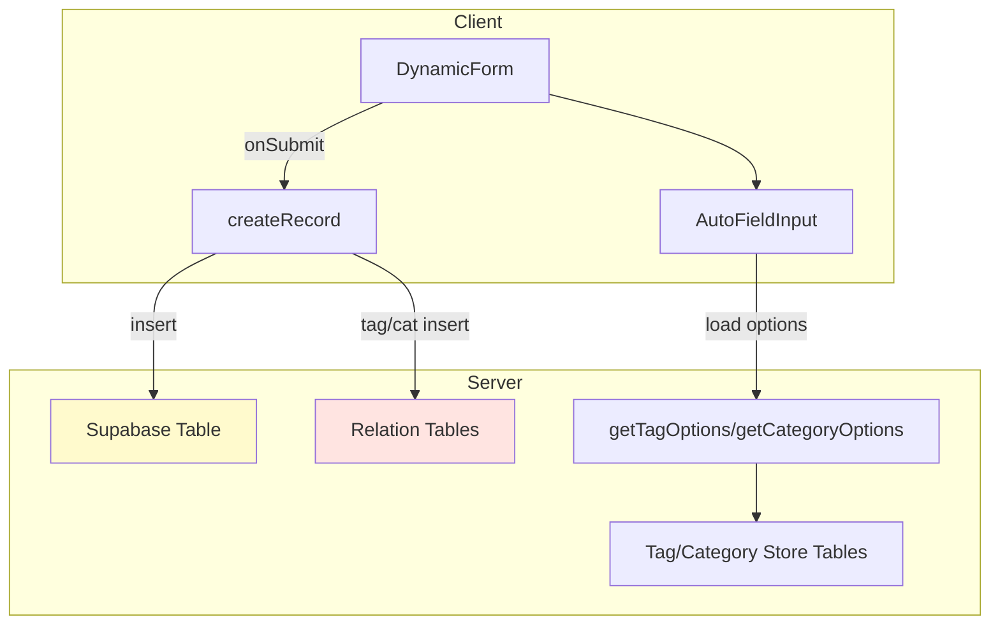

## 🧭 Form Builder System Overview

### 1. 🧠 **Entity Config (e.g. Person)**

**File:** `/app/person/config/form-config.ts`

Defines the **contract** and metadata for a form:

- `schema`: Zod object for validation
- `fields`: list of field configs (`type`, `label`, `optionsLoader`)
- `table`: Supabase table to insert into
- `columns`, `displayFields`: optional metadata for listing/display
- `tagStoreTable`, `categoryStoreTable`: optional dynamic lookups

> ✅ This allows DynamicForm and backend actions to work **without hardcoding entity specifics**.

---

### 2. 🧩 **DynamicForm Component**

**File:** `/components/form-builder/core/dynamic-form.tsx`

Fully reusable client-side form powered by:

- `react-hook-form` + `zodResolver`
- Accepts any schema + field definitions
- Dynamically renders input fields via `AutoFieldInput`
- Submits values via passed `onSubmit()` handler

> ✅ Used by all `create`/`edit` pages for any entity.

---

### 3. ⚙️ **Supabase Actions**

**Files:** `/components/form-builder/actions/*.ts`

Reusable server-side logic:

| File                      | Purpose                                                      |
| ------------------------- | ------------------------------------------------------------ |
| `create-record.ts`        | Inserts into main table + related tags/categories via config |
| `get-tag-options.ts`      | Dynamically fetches tag options from config-defined table    |
| `get-category-options.ts` | Same, but for categories                                     |
| `get-record.ts`           | Fetches a single entity by ID                                |
| `get-all-records.ts`      | List all entities of given table                             |

> ✅ All these use a **shared config object** per entity to stay flexible and DRY.

---

### 4. 🧱 **Field Input Renderer**

**File:** `/components/form-builder/core/auto-field-input.tsx`

Handles how each field is rendered:

- Maps `type: "text" | "checkbox" | "multi-select" | "image-multi"` → correct component
- Injects field options, labels, etc.

> ✅ Keeps `DynamicForm` logic clean and scalable.

---

### 5. 🧑‍💼 **Person Implementation**

**Structure:**

```
/app/person
├── config/form-config.ts      <-- defines schema, fields, table
├── create/client-form.tsx     <-- uses DynamicForm + personConfig
├── [id]/page.tsx              <-- detail/edit page
├── page.tsx                   <-- list or landing
```

> ✅ Easy to replicate for other entities (e.g. `/company`, `/project`).

---

### 🔄 Data Flow



---

### ✅ Summary

| Feature                | Status            |
| ---------------------- | ----------------- |
| Dynamic schemas        | ✅ using Zod      |
| Config-driven fields   | ✅ with `fields`  |
| Relation config        | ✅ via tags/cats  |
| Dynamic form rendering | ✅ `DynamicForm`  |
| Supabase inserts       | ✅ `createRecord` |
| Option fetching        | ✅ config-aware   |

---

**Would you like a `makeEntityConfig()` factory to eliminate repetition across entities?**
Or want a scaffold generator for new entity folders?

---

we are creating a sort of dynamic form system. let me give you an overview so you clearly understand, reason being is that we will create a custom multi select component that will use either categories or tags we want to make sure everything is compatible and best practice:

# Next.js Form Builder with Supabase

A modern web application built with Next.js 15 app router, featuring a form builder system integrated with Supabase for data storage and image handling.

## Features

- Server-side rendering with Next.js 15
- Supabase integration for backend storage
- Dynamic form building capabilities
- Image upload and viewing functionality
- Responsive UI using Tailwind CSS
- Type-safe development with TypeScript

## Tech Stack

- **Frontend**: Next.js 14, TypeScript, Tailwind CSS
- **UI Components**: shadcn/ui
- **Backend/Database**: Supabase
- **Icons**: Lucide Icons

## Getting Started

1. Clone the repository
2. Install dependencies:

tree /Users/wolf/Documents/Development/Projects/Form-Builder/form-builder/src
/Users/wolf/Documents/Development/Projects/Form-Builder/form-builder/src
├── app
│   ├── favicon.ico
│   ├── globals.css
│   ├── layout.tsx
│   ├── page.tsx
│   └── person
│   ├── \[id]
│   │   └── page.tsx
│   ├── config
│   │   └── form-config.ts
│   ├── create
│   │   └── page.tsx
│   └── page.tsx
├── components
│   ├── form-builder
│   │   ├── actions
│   │   │   ├── create-record.ts
│   │   │   ├── get-all-records.ts
│   │   │   ├── get-record.ts
│   │   │   └── list-records.ts
│   │   ├── core
│   │   │   ├── auto-field-input.tsx
│   │   │   ├── field-registry.ts
│   │   │   ├── generic-form.tsx
│   │   │   └── types.ts
│   │   └── custom-fields
│   │   ├── index.tsx
│   │   └── sb-image-uploader.tsx
│   ├── images
│   │   └── image-viewer.tsx
│   └── ui
│   ├── badge.tsx
│   ├── button.tsx
│   ├── checkbox.tsx
│   ├── command.tsx
│   ├── dialog.tsx
│   ├── form.tsx
│   ├── input.tsx
│   ├── label.tsx
│   ├── popover.tsx
│   ├── switch.tsx
│   └── textarea.tsx
├── lib
│   └── utils.ts
├── schemas
└── utils
├── cn.ts
├── supabase
│   ├── client.ts
│   ├── middleware.ts
│   └── server.ts
└── utils.ts

16 directories, 36 files

src/app/person/\[id]/page.tsx

import { notFound } from "next/navigation";
import { getRecord } from "@/components/form-builder/actions/get-record";
import { personConfig, type PersonRecord } from "../config/form-config";
import Link from "next/link";
import ImageViewer from "@/components/images/image-viewer";

interface PersonPageProps {
params: Promise<{ id: string }>;
}

export default async function PersonPage({ params }: PersonPageProps) {
const { id } = await params;

const person = await getRecord<PersonRecord>(personConfig, id);

if (!person) return notFound();

const photoUrls = Array.isArray(person.images)
? person.images.map((img) => img.url)
: \[];

return ( <div className="max-w-2xl mx-auto py-10 space-y-6"> <div className="mb-4"> <Link href="/person">{"<--"} Back to All Persons</Link> </div>

```
  <ImageViewer photoUrls={photoUrls} height={300} url={`/person/${id}`} />

  <h1 className="text-4xl font-bold">{person.name}</h1>
  <ul className="space-y-4 text-lg">
    <li>
      <strong>Email:</strong> {person.email || "N/A"}
    </li>
    <li>
      <strong>Phone:</strong> {person.phone || "N/A"}
    </li>
    <li>
      <strong>Bio:</strong> {person.bio || "N/A"}
    </li>
    <li>
      <strong>Active:</strong> {person.active ? "Yes" : "No"}
    </li>
  </ul>
</div>
```

);
}

src/app/person/config/form-config.ts

import { z } from "zod";

export const PersonSchema = z.object({
name: z.string().min(1, "Name required"),
email: z.string().email(),
phone: z.string().optional(),
bio: z.string().optional(),
active: z.boolean().optional(),
images: z
.array(
z.object({
url: z.string().url(),
caption: z.string().optional(),
})
)
.optional(), // <-- This makes the entire "images" field optional
});

export type PersonType = z.infer<typeof PersonSchema>;

export type PersonRecord = PersonType & {
id: string;
created_at?: string;
updated_at?: string;
};

export const personFields = \[
{ name: "name", label: "Name", type: "text" },
{ name: "email", label: "Email", type: "text" },
{ name: "phone", label: "Phone", type: "text" },
{ name: "bio", label: "Bio", type: "textarea" },
{ name: "active", label: "Active", type: "checkbox" },
{
name: "images",
label: "Images",
type: "image-multi",
bucket: "person-images",
},
];

// person-form-config.ts
export const personConfig = {
schema: PersonSchema,
fields: personFields,
table: "form_builder_person",
columns: \["id", "name", "email", "phone", "bio", "active", "created_at"],
displayFields: \["name", "email"], // optionally used
};

src/app/person/create/page.tsx

"use client";

import { useRouter } from "next/navigation";
import { DynamicForm } from "@/components/form-builder/core/dynamic-form";
import { createRecord } from "@/components/form-builder/actions/create-record";
import {
personConfig,
PersonSchema,
personFields,
} from "../config/form-config";

import type { PersonRecord } from "../config/form-config";

export default function CreatePersonPage() {
const router = useRouter();

return ( <div className="max-w-2xl mx-auto py-10"> <h1 className="text-4xl font-bold mb-8">Create Person</h1>
\<DynamicForm
schema={PersonSchema}
fields={personFields}
onSubmit={async (values) => {
try {
const newPerson = await createRecord<PersonRecord>(
personConfig,
values
);
router.push(`/person/${newPerson.id}`);
} catch (error) {
console.error("❌ Failed to create person:", error);
}
}}
/> </div>
);
}

src/components/form-builder/actions/create-record.ts

// src/components/form-builder/actions/create-record.ts
"use server";

import { createClient } from "@/utils/supabase/server";

interface CreateRecordConfig {
table: string;
}

export async function createRecord\<T extends { id: string }>(
config: CreateRecordConfig,
values: unknown
): Promise<T> {
const supabase = await createClient();

const { data, error } = await supabase
.from(config.table)
.insert(\[values])
.select("\*") // include `id` in response
.single();

if (error) {
console.error("❌ Supabase Insert Error:", error.message, error.details);
throw new Error("Failed to create record.");
}

return data as T;
}

src/components/form-builder/actions/get-all-records.ts

import { createClient } from "@/utils/supabase/server";

interface Config {
table: string;
select?: string;
}

type GenericStringError = { message: string };

export async function getAllRecords<T>(
config: Config
): Promise\<T\[] | GenericStringError\[]> {
const supabase = await createClient();

const { data, error } = await supabase
.from(config.table)
.select(config.select ?? "\*")
.order("created_at", { ascending: false });

if (error) {
console.error("❌ Supabase fetch error:", error.message);
return \[{ message: error.message }];
}

return (data ?? \[]) as T\[] | GenericStringError\[];
}

src/components/form-builder/actions/get-record.ts

// src/components/form-builder/actions/get-record.ts
"use server";

import { createClient } from "@/utils/supabase/server";

interface Config {
table: string;
select?: string;
}

export async function getRecord<T>(
config: Config,
id: string
): Promise\<T | null> {
const supabase = await createClient();

const { data, error } = await supabase
.from(config.table)
.select(config.select ?? "\*")
.eq("id", id)
.single();

if (error) {
console.error("❌ Supabase fetch error:", error.message);
return null;
}

return data as T;
}

src/components/form-builder/actions/list-records.ts

// src/components/form-builder/actions/list-records.ts
"use server";

import { createClient } from "@/utils/supabase/server";

export async function listRecords\<T = unknown>(table: string): Promise\<T\[]> {
const supabase = await createClient();

const { data, error } = await supabase
.from(table)
.select("\*")
.order("created_at", { ascending: false });

if (error) {
console.error(`❌ Failed to list from ${table}:`, error.message);
throw new Error("Could not list records.");
}

return data ?? \[];
}

src/components/form-builder/core/auto-field-input.tsx

// src/components/form-builder/core/auto-field-input.tsx

"use client";

import type { Control, FieldValues, Path } from "react-hook-form";
import {
FormField,
FormItem,
FormLabel,
FormControl,
FormMessage,
} from "@/components/ui/form";
import {
ZodString,
ZodNumber,
ZodBoolean,
ZodOptional,
type ZodTypeAny,
} from "zod";
import { fieldRegistry } from "@/components/form-builder/core/field-registry";

// components
import { Input } from "@/components/ui/input";
import { Textarea } from "@/components/ui/textarea";
import { Switch } from "@/components/ui/switch";
import { Checkbox } from "@/components/ui/checkbox";

// custom components
import { SbImageUploader } from "@/components/form-builder/custom-fields";
import type { UploadedPhoto } from "@/components/form-builder/custom-fields/sb-image-uploader";

interface AutoFieldInputProps<T extends FieldValues> {
name: Path<T>;
control: Control<T>;
schema: ZodTypeAny;
label?: string;
fieldType?: string;
bucket?: string;
multi?: boolean;
}

export default function AutoFieldInput<T extends FieldValues>({
name,
control,
schema,
label,
fieldType,
bucket,
multi,
}: AutoFieldInputProps<T>) {
const RegisteredComponent = fieldRegistry\[name as string];

if (RegisteredComponent) {
return (
\<FormField
control={control}
name={name}
render={({ field }) => ( <FormItem> <FormLabel>{label ?? formatLabel(name.toString())}</FormLabel> <FormControl>
\<RegisteredComponent {...field} /> </FormControl> <FormMessage /> </FormItem>
)}
/>
);
}

return (
\<FormField
control={control}
name={name}
render={({ field }) => ( <FormItem> <FormLabel>{label ?? formatLabel(name.toString())}</FormLabel> <FormControl>
{renderInputByType(
unwrapSchema(schema),
field,
fieldType,
bucket,
multi
)} </FormControl> <FormMessage /> </FormItem>
)}
/>
);
}

function unwrapSchema(schema: ZodTypeAny): ZodTypeAny {
return schema instanceof ZodOptional ? schema.\_def.innerType : schema;
}

function renderInputByType(
schema: ZodTypeAny,
field: { name: string; value: unknown; onChange: (value: unknown) => void },
fieldType?: string,
bucket?: string,
multi?: boolean
) {
if (schema instanceof ZodString) {
const isLongText =
field.name.toLowerCase().includes("description") ||
field.name.toLowerCase().includes("bio") ||
fieldType === "textarea";
return isLongText ? (
\<Textarea
placeholder={`Enter ${field.name}`}
name={field.name}
value={typeof field.value === "string" ? field.value : ""}
onChange={(e) => field.onChange(e.target.value)}
className="h-40"
/>
) : (
\<Input
placeholder={`Enter ${field.name}`}
name={field.name}
value={typeof field.value === "string" ? field.value : ""}
onChange={(e) => field.onChange(e.target.value)}
/>
);
}

if (schema instanceof ZodNumber) {
return (
\<Input
type="number"
placeholder={`Enter ${field.name}`}
name={field.name}
value={typeof field.value === "number" ? field.value : ""}
onChange={(e) => {
const parsed = Number(e.target.value);
field.onChange(Number.isNaN(parsed) ? undefined : parsed);
}}
/>
);
}

if (schema instanceof ZodBoolean) {
return fieldType === "checkbox" ? (
// checkbox input <div className="flex items-center justify-start"> <Checkbox
       id={field.name}
       checked={Boolean(field.value)}
       onCheckedChange={field.onChange}
       className="w-4 h-4"
     /> </div>
) : ( <div> <Switch
       id={field.name}
       checked={Boolean(field.value)}
       onCheckedChange={field.onChange}
     /> </div>
);
}

if (fieldType?.startsWith("image")) {
const isMulti = multi ?? fieldType === "image-multi";

```
return (
  <SbImageUploader
    name={field.name}
    value={
      isMulti
        ? ((field.value ?? []) as UploadedPhoto[])
        : ((field.value ?? "") as string)
    }
    onChange={field.onChange as (value: UploadedPhoto[] | string) => void}
    bucket={bucket ?? "default-bucket"}
    multi={isMulti}
  />
);
```

}

return (
\<Input
placeholder={`Enter ${field.name}`}
name={field.name}
value={typeof field.value === "string" ? field.value : ""}
onChange={(e) => field.onChange(e.target.value)}
/>
);
}

function formatLabel(name: string) {
return name.replace(/\_/g, " ").replace(/\b\w/g, (c) => c.toUpperCase());
}

src/components/form-builder/core/field-registry.ts

// src/components/form-builder/core/field-registry.ts

import type { FieldValues } from "react-hook-form";
import type { FC } from "react";
import type { SpecialFieldProps } from "./types";

export const fieldRegistry: Record<
string,
FC\<SpecialFieldProps\<unknown, FieldValues>>

> \= {};

src/components/form-builder/core/types.ts

// src/components/forms/types.ts
import type { FieldValues, FieldPath, UseFormReturn } from "react-hook-form";

export interface SpecialFieldProps<
TValue = unknown,
TFormValues extends FieldValues = FieldValues,

> {
> value: TValue;
> onChange: (value: TValue) => void;
> name: FieldPath<TFormValues>;
> form?: UseFormReturn<TFormValues>;
> }

src/components/form-builder/custom-fields/index.tsx

export { default as SbImageUploader } from "./sb-image-uploader";

src/components/form-builder/custom-fields/sb-image-uploader.tsx

"use client";

import { useEffect, useState } from "react";
import { v4 as uuidv4 } from "uuid";
import { createClient } from "@/utils/supabase/client";
import { Button, buttonVariants } from "@/components/ui/button";
import { Textarea } from "@/components/ui/textarea";
import { Input } from "@/components/ui/input";
import Image from "next/image";

import {
DndContext,
closestCenter,
PointerSensor,
useSensor,
useSensors,
type DragEndEvent,
} from "@dnd-kit/core";
import {
arrayMove,
SortableContext,
verticalListSortingStrategy,
useSortable,
} from "@dnd-kit/sortable";
import { CSS } from "@dnd-kit/utilities";
import { GripVertical } from "lucide-react";

export interface UploadedPhoto {
url: string;
caption?: string;
}

interface SbImageUploaderProps {
value: UploadedPhoto\[] | string;
onChange: (value: UploadedPhoto\[] | string) => void;
name: string;
bucket?: string;
multi?: boolean;
}

const SortablePhoto = ({
id,
index,
photo,
onRemove,
onMoveUp,
onMoveDown,
onCaptionChange,
isFirst,
isLast,
}: {
id: string;
index: number;
photo: UploadedPhoto;
onRemove: () => void;
onMoveUp: () => void;
onMoveDown: () => void;
onCaptionChange: (caption: string) => void;
isFirst: boolean;
isLast: boolean;
}) => {
const { attributes, listeners, setNodeRef, transform, transition } =
useSortable({ id });

const style = {
transform: CSS.Transform.toString(transform),
transition,
};

return (
\<div
ref={setNodeRef}
style={style}
{...attributes}
className="relative border p-2 rounded-md shadow-sm flex flex-col"
\>
\<div {...listeners} className="cursor-grab absolute top-1 left-1"> <GripVertical
       size={26}
       className="py-1 px-0 rounded-md shadow-sm bg-primary text-primary-foreground"
     /> </div>

```
  <Image
    src={photo.url}
    alt={`Uploaded Preview ${index + 1}`}
    className="w-full h-32 object-cover rounded-md"
    width={300}
    height={128}
  />

  <Button
    type="button"
    variant="destructive"
    size="sm"
    onClick={onRemove}
    className="absolute top-1 right-1"
  >
    X
  </Button>

  <div className="flex justify-between items-center mt-2 space-x-2">
    <Button
      type="button"
      size="sm"
      variant="secondary"
      disabled={isFirst}
      onClick={onMoveUp}
    >
      ↑
    </Button>
    <Textarea
      placeholder="Enter caption (optional)"
      value={photo.caption}
      onChange={(e) => onCaptionChange(e.target.value)}
      className="mt-2 text-sm"
    />
    <Button
      type="button"
      size="sm"
      variant="secondary"
      disabled={isLast}
      onClick={onMoveDown}
    >
      ↓
    </Button>
  </div>
</div>
```

);
};

export default function SbImageUploader({
value,
onChange,
name,
bucket = "uploads",
multi = true,
}: SbImageUploaderProps) {
const \[photos, setPhotos] = useState\<UploadedPhoto\[]>(\[]);
const \[uploading, setUploading] = useState(false);
const \[error, setError] = useState\<string | null>(null);
const \[imageUrl, setImageUrl] = useState("");

const supabase = createClient();
const sensors = useSensors(useSensor(PointerSensor));

useEffect(() => {
if (multi) {
setPhotos(Array.isArray(value) ? value : \[]);
} else {
setPhotos(typeof value === "string" && value ? \[{ url: value }] : \[]);
}
}, \[value, multi]);

const updatePhotos = (newPhotos: UploadedPhoto\[]) => {
setPhotos(newPhotos);
if (multi) {
onChange(newPhotos);
} else {
onChange(newPhotos\[0]?.url || "");
}
};

const uploadFiles = async (files: FileList | File\[]) => {
const allowedTypes = \["image/jpeg", "image/png", "image/webp"];
const maxSize = 5 \* 1024 \* 1024;

```
const validFiles = Array.from(files).filter((file) => {
  if (!allowedTypes.includes(file.type)) {
    setError(`Unsupported file type: ${file.name}`);
    return false;
  }
  if (file.size > maxSize) {
    setError(`File too large: ${file.name} (Max: 5MB)`);
    return false;
  }
  return true;
});

if (validFiles.length === 0) return;

setUploading(true);
try {
  const uploadedPhotos: UploadedPhoto[] = [];

  for (const file of validFiles) {
    const fileName = `${uuidv4()}_${file.name}`;
    const filePath = `${fileName}`;

    console.log("Uploading to bucket:", bucket);

    const { error: uploadError } = await supabase.storage
      .from(bucket)
      .upload(filePath, file);

    if (uploadError) throw new Error(uploadError.message);

    const { data } = supabase.storage.from(bucket).getPublicUrl(filePath);

    if (!data.publicUrl) throw new Error("Failed to retrieve public URL");

    uploadedPhotos.push({ url: data.publicUrl, caption: "" });
  }

  const newPhotos = multi
    ? [...photos, ...uploadedPhotos]
    : [uploadedPhotos[0]];

  updatePhotos(newPhotos);
} catch (uploadError: unknown) {
  setError(
    typeof uploadError === "object" &&
      uploadError !== null &&
      "message" in uploadError
      ? String(uploadError.message)
      : "An unknown error occurred"
  );
} finally {
  setUploading(false);
}
```

};

const handleImageUpload = (event: React.ChangeEvent<HTMLInputElement>) => {
setError(null);
const files = event.target.files;
if (!files || files.length === 0) {
setError("Please select at least one file.");
return;
}
uploadFiles(files);
};

const handleAddUrl = () => {
if (!imageUrl) return;
try {
new URL(imageUrl);
} catch {
setError("Invalid URL format.");
return;
}

```
const newPhotos = multi
  ? [...photos, { url: imageUrl, caption: "" }]
  : [{ url: imageUrl, caption: "" }];

updatePhotos(newPhotos);
setImageUrl("");
```

};

const movePhoto = (from: number, to: number) => {
if (to < 0 || to >= photos.length) return;
const updated = \[...photos];
const \[moved] = updated.splice(from, 1);
updated.splice(to, 0, moved);
updatePhotos(updated);
};

const handleDragEnd = (event: DragEndEvent) => {
const { active, over } = event;
if (active.id !== over?.id) {
const oldIndex = photos.findIndex((_, i) => `photo-${i}` === active.id);
const newIndex = photos.findIndex((_, i) => `photo-${i}` === over?.id);
updatePhotos(arrayMove(photos, oldIndex, newIndex));
}
};

const removePhoto = (index: number) => {
const updated = photos.filter((\_, i) => i !== index);
updatePhotos(updated);
};

return ( <div className="flex flex-col space-y-2">
\<label htmlFor={`${name}-file-upload`} className="cursor-pointer">
Upload Image{multi ? "s" : ""} </label>

```
  <div className="flex items-center gap-4">
    <label
      htmlFor={`${name}-file-upload`}
      className={buttonVariants({
        variant: "outline",
        className: `cursor-pointer border p-2 rounded-md hover:bg-muted ${
          uploading ? "opacity-50 cursor-not-allowed" : ""
        }`,
      })}
    >
      {uploading
        ? "Uploading..."
        : multi
          ? "Upload Images"
          : "Upload Image"}
    </label>
    <input
      id={`${name}-file-upload`}
      type="file"
      accept="image/*"
      multiple={multi}
      onChange={handleImageUpload}
      disabled={uploading}
      className="hidden"
    />
  </div>

  <div className="flex items-center space-x-2 pb-2">
    <Input
      type="url"
      placeholder="Enter Image URL"
      value={imageUrl}
      onChange={(e) => setImageUrl(e.target.value)}
    />
    <Button onClick={handleAddUrl} disabled={!imageUrl.trim()}>
      Add
    </Button>
  </div>

  {error && <p className="text-red-500">{error}</p>}

  {photos.length > 0 && (
    <DndContext
      sensors={sensors}
      collisionDetection={closestCenter}
      onDragEnd={handleDragEnd}
    >
      <SortableContext
        items={photos.map((_, i) => `photo-${i}`)}
        strategy={verticalListSortingStrategy}
      >
        <div className="grid grid-cols-2 gap-4">
          {photos.map((photo, index) => (
            <SortablePhoto
              key={`photo-${
                // biome-ignore lint/suspicious/noArrayIndexKey: <explanation>
                index
              }`}
              id={`photo-${index}`}
              index={index}
              photo={photo}
              onRemove={() => removePhoto(index)}
              onMoveUp={() => movePhoto(index, index - 1)}
              onMoveDown={() => movePhoto(index, index + 1)}
              onCaptionChange={(caption) => {
                const updated = [...photos];
                updated[index].caption = caption;
                updatePhotos(updated);
              }}
              isFirst={index === 0}
              isLast={index === photos.length - 1}
            />
          ))}
        </div>
      </SortableContext>
    </DndContext>
  )}
</div>
```

);
}

all make sense?
